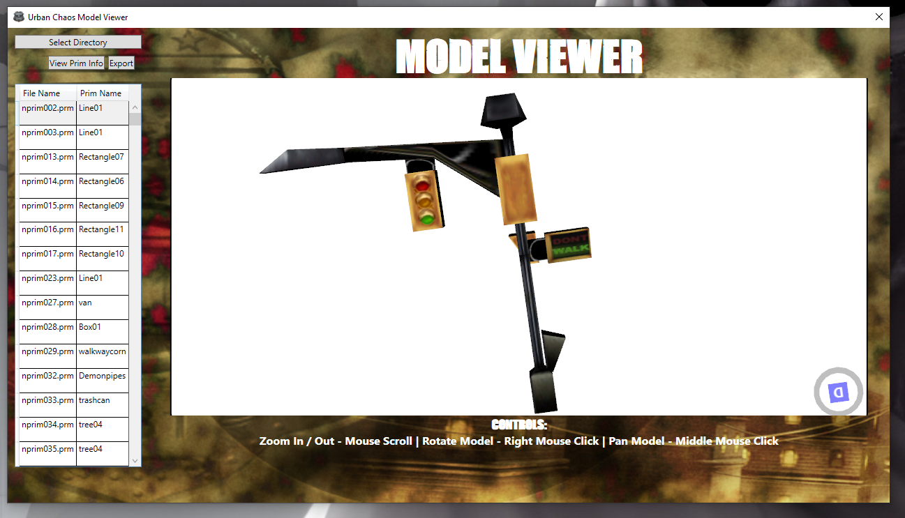
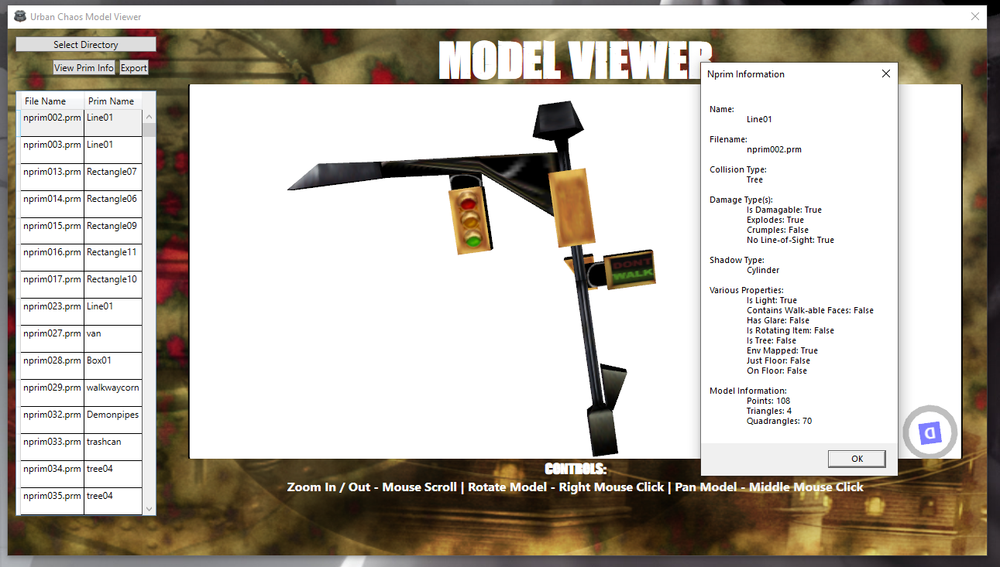
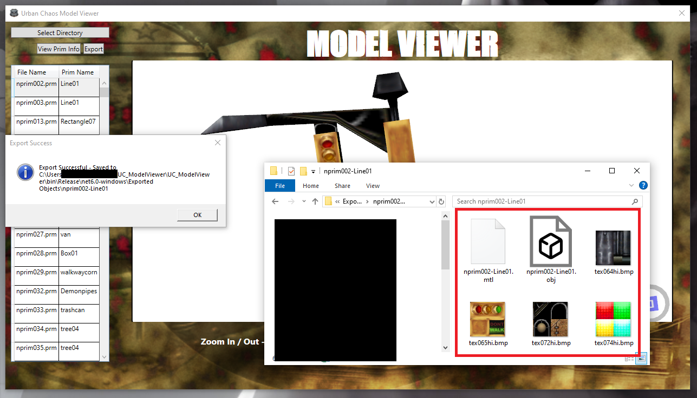

# Urban Chaos Model Viewer

## Overview
The Urban Chaos Model Viewer is a tool designed for the interactive viewing and conversion of 3D models from the PC Game Urban Chaos. It transforms PRM file formats into OBJ formats, employing the Helix Toolkit within a MVVM WPF environment for dynamic 3D model rendering. Note this tool does not come with any game data and requires an installation of Urban Chaos is present.

## Features
- **PRM to OBJ Conversion**: Converts Urban Chaos's PRM model files to the widely used OBJ format on the fly
- **3D Model Rendering**: Utilizes the Helix Toolkit for rendering of 3D models.
- **Texture Support**: Handles texture extraction, conversions and applies them to the rendered models.
- **Interactive User Interface**: Offers an easy-to-use interface for loading, viewing, and exporting models.

## Getting Started
To get started with the Urban Chaos Model Viewer, you'll need to clone the repository and have a WPF-compatible development environment set up.

1. Clone the repository
2. Install NuGet dependencies
   * System.Drawing.Common
   * Helix.WPF
3. Build and run the application

## Usage
- **Loading Models**: Use the "Select Directory" button and point it to the folder containing PRM files (/server/prims). Models will automatically load.
- **Viewing Models**: Select a model from the Data Grid to Interact with the 3D model in the viewport using mouse controls.
- **Viewing PRM Info**: When a model is selected, use the View Prim Info button to view properties about the PRIM.
- **Exporting Models**: Convert and export models to OBJ format with associated textures for use in other 3D tools such as Blender

## Screenshots

## Acknowledgments
- **Pieroz:** Special thanks to [Pieroz](https://github.com/Pieroz) for his Python script for conversion and extraction of PRM to OBJ and Urban Chaos work in general. This project is largely just a port of his work into C#.
- **Divallium:**  Thank you [Divallium](https://code.vonc.fr/?a=60) for initially deducing the NPRIM format
- **Fire-Head:** Big thanks to [Fire-Head](https://github.com/Fire-head) for TXC extraction and TEX to TGA conversion (The code in this project is simply a port of the C++ code)
- **TGASharpLib:** Special thanks to the creators of [TGASharpLib](https://github.com/ALEXGREENALEX/TGASharpLib), which is used for TGA image conversion to bitmap for use in Helix Texture rendering.
- **Helix-Toolkit:** Developers of [Helix Toolkit](https://github.com/helix-toolkit/helix-toolkit) for doing heavy lifting with 3D rendering despite being slightly buggy. <3

## Contributing
Contributions to the Urban Chaos Model Viewer are welcome. Please feel free to fork the repository, make your changes, and submit a pull request.

## License
This project is licensed under the MIT License - see the [LICENSE.txt](LICENSE.txt) file for details.
